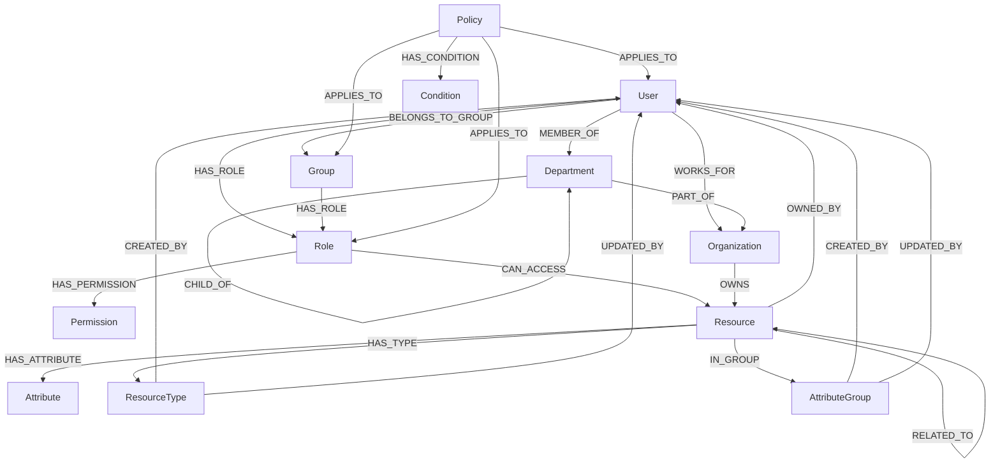
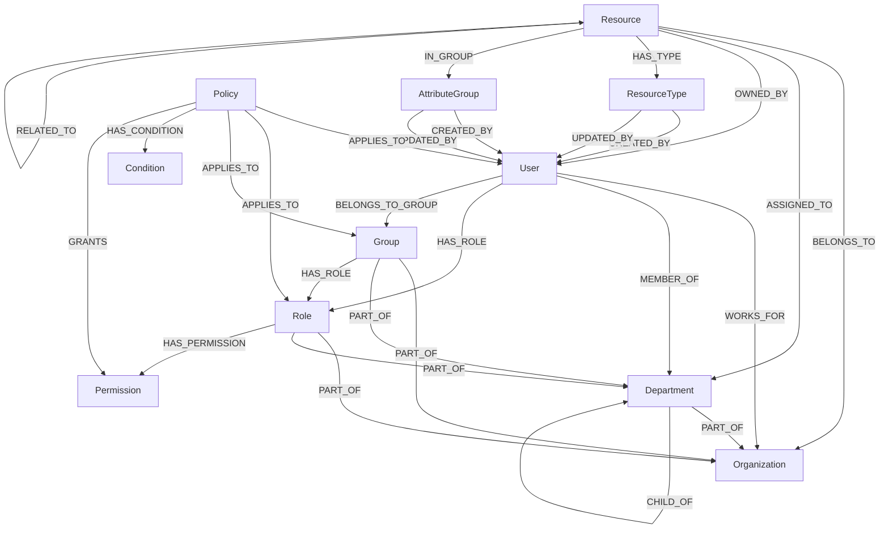

# ABAC Service Schema Documentation

## Table of Contents

1.  [Overview](#overview)
2.  [Entities](#entities)
    - [User](#user)
    - [Organization](#organization)
    - [Department](#department)
    - [Role](#role)
    - [Group](#group)
    - [Permission](#permission)
    - [Policy](#policy)
    - [Resource](#resource)
3.  [Relationships](#relationships)
4.  [Entity Relationship Diagram](#entity-relationship-diagram)
5.  [Key Concepts](#key-concepts)
6.  [Search Criteria](#search-criteria)

## Overview

This documentation outlines the schema for an Attribute-Based Access Control (ABAC) service implemented using Neo4j as the data storage and Go for the backend. The system manages users, organizations, departments, roles, groups, permissions, policies, and resources, providing a flexible and powerful access control mechanism.

## Entities

### User

The User entity represents individuals who interact with the system.

**Important Attributes:**

- `ID`: Unique identifier for the user
- `Name`: User's full name
- `Username`: Unique username for the user
- `Email`: User's email address
- `UserType`: Type of user (e.g., "AliveLife", "CorporateAdmin", "DepartmentUser")
- `OrganizationID`: ID of the organization the user belongs to
- `DepartmentID`: ID of the department the user belongs to
- `RoleIds`: List of role IDs assigned to the user
- `GroupIds`: List of group IDs the user belongs to
- `Permissions`: List of permission IDs directly assigned to the user
- `Attributes`: Key-value pairs for additional user attributes
- `Status`: User's current status (e.g., "Active", "Inactive", "Suspended")

### Organization

The Organization entity represents the top-level structure in the system.

**Important Attributes:**

- `ID`: Unique identifier for the organization
- `Name`: Name of the organization

### Department

The Department entity represents divisions within an organization.

**Important Attributes:**

- `ID`: Unique identifier for the department
- `Name`: Name of the department
- `OrganizationID`: ID of the organization the department belongs to
- `ParentID`: ID of the parent department (for hierarchical structure)

### Role

The Role entity represents a set of permissions that can be assigned to users.

**Important Attributes:**

- `ID`: Unique identifier for the role
- `Name`: Name of the role
- `Description`: Description of the role's purpose
- `OrganizationID`: ID of the organization the role belongs to
- `DepartmentID`: ID of the department the role belongs to (optional)
- `Permissions`: List of permission IDs associated with the role
- `Attributes`: Key-value pairs for additional role attributes

### Group

The Group entity represents collections of users with shared characteristics or permissions.

**Important Attributes:**

- `ID`: Unique identifier for the group
- `Name`: Name of the group
- `Description`: Description of the group's purpose
- `OrganizationID`: ID of the organization the group belongs to
- `DepartmentID`: ID of the department the group belongs to (optional)
- `Roles`: List of role IDs associated with the group
- `Attributes`: Key-value pairs for additional group attributes

### Permission

The Permission entity represents specific actions that can be performed within the system.

**Important Attributes:**

- `ID`: Unique identifier for the permission
- `Name`: Name of the permission
- `Description`: Description of the permission's purpose
- `Action`: Specific action allowed by the permission (e.g., "read", "write", "delete")

### Policy

The Policy entity defines access control rules based on attributes.

**Important Attributes:**

- `ID`: Unique identifier for the policy
- `Name`: Name of the policy
- `Description`: Description of the policy's purpose
- `Effect`: Whether the policy allows or denies access ("allow" or "deny")
- `Subjects`: List of subjects (users, roles, or groups) the policy applies to
- `ResourceTypes`: List of resource types the policy governs
- `AttributeGroups`: List of attribute groups associated with the policy
- `Actions`: List of actions (permissions) governed by the policy
- `Conditions`: List of conditions that must be met for the policy to apply
- `Priority`: Priority level of the policy
- `Active`: Whether the policy is currently active

### Resource

The Resource entity represents objects or data that are protected by access control policies.

**Important Attributes:**

- `ID`: Unique identifier for the resource
- `Name`: Name of the resource
- `Description`: Description of the resource
- `Type`: Type of resource (e.g., "DOCUMENT", "APPLICATION", "API")
- `TypeID`: ID of the ResourceType this resource belongs to
- `URI`: Uniform Resource Identifier
- `OrganizationID`: ID of the organization that owns the resource
- `DepartmentID`: ID of the department that owns the resource
- `OwnerID`: User ID of the resource owner
- `Status`: Current status of the resource (e.g., "active", "archived", "deleted")
- `Tags`: List of tags associated with the resource
- `Metadata`: Additional metadata for the resource
- `AttributeGroupID`: ID of the AttributeGroup this resource belongs to
- `Sensitivity`: Sensitivity level of the resource
- `Classification`: Classification of the resource
- `Location`: Physical or logical location of the resource
- `Format`: Format of the resource (e.g., "pdf", "docx", "json")
- `ACL`: Access Control List for the resource
- `Attributes`: Custom attributes for flexible ABAC policies

### ResourceType

The ResourceType entity represents a classification or category for resources in the system.

**Important Attributes:**

- `ID`: Unique identifier for the resource type
- `Name`: Name of the resource type
- `Description`: Description of the resource type's purpose
- `CreatedBy`: ID of the user who created the resource type
- `UpdatedBy`: ID of the user who last updated the resource type

### AttributeGroup

The AttributeGroup entity represents a collection of attributes that can be associated with resources.

**Important Attributes:**

- `ID`: Unique identifier for the attribute group
- `Name`: Name of the attribute group
- `Attributes`: Map of attribute key-value pairs
- `CreatedBy`: ID of the user who created the attribute group
- `UpdatedBy`: ID of the user who last updated the attribute group

### Condition

The Condition entity represents specific criteria that must be met for a policy to apply.

**Important Attributes:**

- `ID`: Unique identifier for the condition
- `Attribute`: The attribute to be evaluated
- `Operator`: The comparison operator (e.g., "equals", "greater than", "contains")
- `Value`: The value to compare against
- `IsDynamic`: Indicates if the condition uses dynamic attributes

## Relationships

### User Relationships

- WORKS_FOR: User -> Organization

  - Description: Represents the organization a user works for.
  - Cardinality: Many-to-One (A user works for one organization, an organization can have many users)

- MEMBER_OF: User -> Department

  - Description: Represents the department a user belongs to.
  - Cardinality: Many-to-One (A user can be a member of one department, a department can have many users)

- HAS_ROLE: User -> Role

  - Description: Represents the roles assigned to a user.
  - Cardinality: Many-to-Many (A user can have multiple roles, a role can be assigned to multiple users)

- BELONGS_TO_GROUP: User -> Group
  - Description: Represents the groups a user belongs to.
  - Cardinality: Many-to-Many (A user can belong to multiple groups, a group can have multiple users)

### Organization Relationships

- OWNS: Organization -> Resource
  - Description: Represents the resources owned by an organization.
  - Cardinality: One-to-Many (An organization can own many resources, a resource is owned by one organization)

### Department Relationships

- PART_OF: Department -> Organization

  - Description: Represents the organization a department belongs to.
  - Cardinality: Many-to-One (Many departments can be part of one organization)

- CHILD_OF: Department -> Department
  - Description: Represents the hierarchical relationship between departments.
  - Cardinality: Many-to-One (A department can have one parent, a parent can have many child departments)

### Role Relationships

- PART_OF: Role -> Organization

  - Description: Represents the organization that the role belongs to.
  - Cardinality: Many-to-One (Many roles can be part of one organization)

- PART_OF: Role -> Department

  - Description: Represents the department that the role belongs to (if applicable).
  - Cardinality: Many-to-One (Many roles can be part of one department)

- HAS_PERMISSION: Role -> Permission
  - Description: Represents the permissions assigned to the role.
  - Cardinality: Many-to-Many (A role can have multiple permissions, and a permission can be assigned to multiple roles)

### Group Relationships

- PART_OF: Group -> Organization

  - Description: Represents the organization that the group belongs to.
  - Cardinality: Many-to-One (Many groups can be part of one organization)

- PART_OF: Group -> Department

  - Description: Represents the department that the group belongs to (if applicable).
  - Cardinality: Many-to-One (Many groups can be part of one department)

- HAS_ROLE: Group -> Role
  - Description: Represents the roles assigned to the group.
  - Cardinality: Many-to-Many (A group can have multiple roles, and a role can be assigned to multiple groups)

### Permission Relationships

- GRANTED_BY: Permission -> Policy
  - Description: Represents the policies that grant this permission.
  - Cardinality: Many-to-Many (A permission can be granted by multiple policies, and a policy can grant multiple permissions)

### Policy Relationships

- APPLIES_TO: Policy -> User

  - Description: Represents the users a policy applies to.
  - Cardinality: Many-to-Many (A policy can apply to multiple users, and a user can be subject to multiple policies)

- APPLIES_TO: Policy -> Role

  - Description: Represents the roles a policy applies to.
  - Cardinality: Many-to-Many (A policy can apply to multiple roles, and a role can be subject to multiple policies)

- APPLIES_TO: Policy -> Group

  - Description: Represents the groups a policy applies to.
  - Cardinality: Many-to-Many (A policy can apply to multiple groups, and a group can be subject to multiple policies)

- HAS_CONDITION: Policy -> Condition
  - Description: Represents the conditions that must be met for a policy to apply.
  - Cardinality: One-to-Many (A policy can have multiple conditions, a condition belongs to one policy)

### Resource Relationships

- BELONGS_TO: Resource -> Organization

  - Description: Represents the organization that owns the resource.
  - Cardinality: Many-to-One (A resource belongs to one organization, an organization can have many resources)

- ASSIGNED_TO: Resource -> Department

  - Description: Represents the department the resource is assigned to.
  - Cardinality: Many-to-One (A resource can be assigned to one department, a department can have many resources)

- OWNED_BY: Resource -> User

  - Description: Represents the user who owns the resource.
  - Cardinality: Many-to-One (A resource is owned by one user, a user can own many resources)

- HAS_TYPE: Resource -> ResourceType

  - Description: Represents the type of the resource.
  - Cardinality: Many-to-One (A resource has one type, a type can be associated with many resources)

- IN_GROUP: Resource -> AttributeGroup

  - Description: Represents the attribute group the resource belongs to.
  - Cardinality: Many-to-One (A resource belongs to one attribute group, an attribute group can have many resources)

- CHILD_OF: Resource -> Resource

  - Description: Represents a hierarchical relationship between resources.
  - Cardinality: Many-to-One (A resource can have one parent, a parent can have many child resources)

- RELATED_TO: Resource -> Resource
  - Description: Represents relationships between related resources.
  - Cardinality: Many-to-Many (A resource can be related to multiple resources, and vice versa)

### AttributeGroup Relationships

- CREATED_BY: AttributeGroup -> User

  - Description: Represents the user who created the attribute group.
  - Cardinality: Many-to-One (Many attribute groups can be created by one user)

- UPDATED_BY: AttributeGroup -> User
  - Description: Represents the user who last updated the attribute group.
  - Cardinality: Many-to-One (Many attribute groups can be updated by one user)

### ResourceType Relationships

- CREATED_BY: ResourceType -> User

  - Description: Represents the user who created the resource type.
  - Cardinality: Many-to-One (Many resource types can be created by one user)

- UPDATED_BY: ResourceType -> User
  - Description: Represents the user who last updated the resource type.
  - Cardinality: Many-to-One (Many resource types can be updated by one user)

### Condition Relationships

- PART_OF: Condition -> Policy
  - Description: Represents the policy that the condition is a part of.
  - Cardinality: Many-to-One (Many conditions can be part of one policy)

## Entity Relationship Diagram

## Key Concepts

1.  **Attribute-Based Access Control (ABAC)**: The system uses ABAC to make access control decisions based on attributes of users, resources, and environmental conditions.
2.  **Policies**: Policies define the rules for access control, combining subjects, resources, actions, and conditions.
3.  **Dynamic Attributes**: The system supports dynamic attributes that can change based on context, such as time or location.
4.  **Hierarchical Structures**: Organizations and Departments can have hierarchical relationships.
5.  **Flexible Permissions**: Permissions can be assigned directly to users, through roles, or via group memberships.

## Search Criteria

The system provides search functionality for various entities:

1.  **UserSearchCriteria**: Allows searching for users based on attributes like ID, name, username, email, user type, organization, department, role, group, status, and custom attributes.
2.  **OrganizationSearchCriteria**: Enables searching for organizations by name, ID, and creation date range.
3.  **DepartmentSearchCriteria**: Supports searching for departments by ID, name, organization, parent department, and creation date range.
4.  **PolicySearchCriteria**: Allows searching for policies based on name, effect, priority range, active status, and creation/update date range.
5.  **ResourceSearchCriteria**: Enables searching for resources based on various attributes including ID, name, type, organization, department, owner, status, sensitivity, classification, tags, and custom attributes.

### Organization Relationships

The `CreateOrganization` function doesn't directly establish any relationships between the Organization and other entities. However, it creates the Organization node in the graph database. Other relationships to the Organization are typically created when creating or updating related entities. Based on the previously documented relationships, we can infer the following:

1. **OWNS**: Organization -> Resource

   - Description: Represents the organization a user works for.
   - Cardinality: Many-to-One (Many users can work for one organization)
   - Creation: Established when creating a User with a non-null `organizationID`.

The Organization node is created with the following properties:

- `id`: A unique identifier for the organization
- `name`: The name of the organization
- `createdAt`: Timestamp of when the organization was created
- `updatedAt`: Timestamp of when the organization was last updated

Additional relationships or properties might be added in other parts of the application not shown in this specific function.

### Department Relationships

1. **PART_OF**: Department -> Organization

   - Description: Represents the organization that the department is a part of.
   - Cardinality: Many-to-One (Many departments can be part of one organization)
   - Creation: Always established when a department is created, using the `OrganizationID`.
   - Cypher Relationship: `(d:DEPARTMENT)-[:PART_OF]->(o:ORGANIZATION)`

2. **CHILD_OF**: Department -> Department
   - Description: Represents the hierarchical relationship between departments.
   - Cardinality: Many-to-One (A department can have one parent, a parent can have many child departments)
   - Creation: Established when a department is created with a non-null `ParentID`.
   - Cypher Relationship: `(d:DEPARTMENT)-[:CHILD_OF]->(parent:DEPARTMENT)`

Additionally, based on previously documented relationships, we can infer:

3. **MEMBER_OF**: User -> Department

   - Description: Represents the department a user belongs to.
   - Cardinality: Many-to-One (Many users can be members of one department)
   - Creation: Established when creating a User with a non-null `departmentID`.
   - Note: This relationship is not created in the `CreateDepartment` function but is relevant to the Department entity.

4. **ASSIGNED_TO**: Resource -> Department
   - Description: Represents the department a resource is assigned to.
   - Cardinality: Many-to-One (Many resources can be assigned to one department)
   - Creation: Established when creating a Resource with a non-null `departmentID`.
   - Note: This relationship is not created in the `CreateDepartment` function but is relevant to the Department entity.

The Department node is created with the following properties:

- `id`: A unique identifier for the department
- `name`: The name of the department
- `organizationID`: The ID of the organization the department belongs to
- `parentID`: The ID of the parent department (if any)
- `createdAt`: Timestamp of when the department was created
- `updatedAt`: Timestamp of when the department was last updated

Note: The function includes a verification step (`verifyRelationships`) to ensure that the relationships are properly created. This adds an extra layer of data integrity to the department creation process.

### Permission Relationships

The `CreatePermission` function itself doesn't directly establish any relationships between the Permission and other entities. However, it creates the Permission node in the graph database. Other relationships to the Permission are typically created when creating or updating related entities. Based on the previously documented relationships and common access control patterns, we can infer the following:

1. **HAS_PERMISSION**: Role -> Permission

   - Description: Represents the permissions assigned to a role.
   - Cardinality: Many-to-Many (A role can have multiple permissions, and a permission can be assigned to multiple roles)
   - Creation: Likely established when creating or updating a Role (not shown in the provided code).

2. **HAS_PERMISSION**: User -> Permission (Direct Assignment)

   - Description: Represents permissions directly assigned to a user (if supported by the system).
   - Cardinality: Many-to-Many (A user can have multiple permissions directly assigned, and a permission can be directly assigned to multiple users)
   - Creation: Likely established when updating a User's permissions (not shown in the provided code).

3. **GRANTS**: Policy -> Permission
   - Description: Represents the permissions granted by a policy.
   - Cardinality: Many-to-Many (A policy can grant multiple permissions, and a permission can be granted by multiple policies)
   - Creation: Likely established when creating or updating a Policy (not shown in the provided code).

The Permission node is created with the following properties:

- `id`: A unique identifier for the permission
- `name`: The name of the permission
- `description`: A description of what the permission allows
- `action`: The specific action allowed by the permission (e.g., "read", "write", "delete")

Note: While these relationships are not created in the `CreatePermission` function itself, they are important to understand the role of the Permission entity in the overall access control model. The Permission serves as a fundamental building block for defining what actions can be performed on resources.

Additional relationships or properties might be added in other parts of the application not shown in this specific function. The exact relationships and their implementations may vary depending on the specific access control model used in the system.

### Role Relationships

1. **PART_OF**: Role -> Organization

   - Description: Represents the organization that the role belongs to.
   - Cardinality: Many-to-One (Many roles can be part of one organization)
   - Creation: Always established when a role is created, using the `OrganizationID`.
   - Cypher Relationship: `(r:ROLE)-[:PART_OF]->(o:ORGANIZATION)`

2. **PART_OF**: Role -> Department

   - Description: Represents the department that the role belongs to (if applicable).
   - Cardinality: Many-to-One (Many roles can be part of one department)
   - Creation: Established when a role is created with a non-null `DepartmentID`.
   - Cypher Relationship: `(r:ROLE)-[:PART_OF]->(d:DEPARTMENT)`

3. **HAS_PERMISSION**: Role -> Permission
   - Description: Represents the permissions assigned to the role.
   - Cardinality: Many-to-Many (A role can have multiple permissions, and a permission can be assigned to multiple roles)
   - Creation: Established for each permission ID provided in the `Permissions` list when creating a role.
   - Cypher Relationship: `(r:ROLE)-[:HAS_PERMISSION]->(p:PERMISSION)`

Additionally, based on previously documented relationships, we can infer:

4. **HAS_ROLE**: User -> Role
   - Description: Represents the roles assigned to a user.
   - Cardinality: Many-to-Many (A user can have multiple roles, and a role can be assigned to multiple users)
   - Creation: Established when assigning roles to a user (not shown in this function).
   - Note: This relationship is not created in the `CreateRole` function but is relevant to the Role entity.

The Role node is created with the following properties:

- `id`: A unique identifier for the role
- `name`: The name of the role
- `description`: A description of the role
- `organizationID`: The ID of the organization the role belongs to
- `departmentID`: The ID of the department the role belongs to (if applicable)
- `attributes`: JSON string of additional attributes for the role (if any)
- `createdAt`: Timestamp of when the role was created
- `updatedAt`: Timestamp of when the role was last updated

Note: The function uses MERGE instead of CREATE, which ensures that a role with the same ID is not created multiple times. If a role with the given ID already exists, it will be updated instead of creating a new one.

### Group Relationships

1. **PART_OF**: Group -> Organization

   - Description: Represents the organization that the group belongs to.
   - Cardinality: Many-to-One (Many groups can be part of one organization)
   - Creation: Always established when a group is created, using the `OrganizationID`.
   - Cypher Relationship: `(g:GROUP)-[:PART_OF]->(o:ORGANIZATION)`

2. **PART_OF**: Group -> Department

   - Description: Represents the department that the group belongs to (if applicable).
   - Cardinality: Many-to-One (Many groups can be part of one department)
   - Creation: Established when a group is created with a non-null `DepartmentID`.
   - Cypher Relationship: `(g:GROUP)-[:PART_OF]->(d:DEPARTMENT)`

3. **HAS_ROLE**: Group -> Role
   - Description: Represents the roles assigned to the group.
   - Cardinality: Many-to-Many (A group can have multiple roles, and a role can be assigned to multiple groups)
   - Creation: Established for each role ID provided in the `Roles` list when creating a group.
   - Cypher Relationship: `(g:GROUP)-[:HAS_ROLE]->(r:ROLE)`

Additionally, based on previously documented relationships, we can infer:

4. **BELONGS_TO_GROUP**: User -> Group
   - Description: Represents the groups a user belongs to.
   - Cardinality: Many-to-Many (A user can belong to multiple groups, and a group can have multiple users)
   - Creation: Established when assigning users to a group (not shown in this function).
   - Note: This relationship is not created in the `CreateGroup` function but is relevant to the Group entity.

The Group node is created with the following properties:

- `id`: A unique identifier for the group
- `name`: The name of the group
- `description`: A description of the group
- `organizationID`: The ID of the organization the group belongs to
- `departmentID`: The ID of the department the group belongs to (if applicable)
- `attributes`: JSON string of additional attributes for the group (if any)
- `createdAt`: Timestamp of when the group was created
- `updatedAt`: Timestamp of when the group was last updated

Note: The function uses MERGE instead of CREATE, which ensures that a group with the same ID is not created multiple times. If a group with the given ID already exists, it will be updated instead of creating a new one.

### AttributeGroup Entity and Relationships

The AttributeGroup entity represents a collection of attributes that can be associated with other entities in the system, particularly with resources. While the `CreateAttributeGroup` function doesn't directly establish relationships with other entities, the AttributeGroup plays a crucial role in the Attribute-Based Access Control (ABAC) system.

#### Entity Properties:

- `ID`: A unique identifier for the attribute group
- `Name`: The name of the attribute group
- `Attributes`: A JSON-encoded string representing a map of attribute key-value pairs
- `CreatedBy`: The ID of the user who created the attribute group
- `UpdatedBy`: The ID of the user who last updated the attribute group
- `CreatedAt`: Timestamp of when the attribute group was created
- `UpdatedAt`: Timestamp of when the attribute group was last updated

#### Implied Relationships:

1. **HAS_ATTRIBUTE_GROUP**: Resource -> AttributeGroup

   - Description: Represents the association between a resource and its attribute group.
   - Cardinality: Many-to-One (Many resources can be associated with one attribute group)
   - Creation: This relationship would typically be established when creating or updating a Resource, not in this function.
   - Note: This relationship is inferred from the Resource model, which includes an `AttributeGroupID` field.

2. **CREATED_BY**: AttributeGroup -> User

   - Description: Represents the user who created the attribute group.
   - Cardinality: Many-to-One (Many attribute groups can be created by one user)
   - Creation: This relationship is implied by the `CreatedBy` field but not explicitly created as a graph relationship in this function.

3. **UPDATED_BY**: AttributeGroup -> User
   - Description: Represents the user who last updated the attribute group.
   - Cardinality: Many-to-One (Many attribute groups can be updated by one user)
   - Creation: This relationship is implied by the `UpdatedBy` field but not explicitly created as a graph relationship in this function.

#### Role in ABAC:

The AttributeGroup entity is crucial in implementing ABAC:

- It allows for grouping related attributes, making it easier to manage and assign attributes to resources.
- Policies can reference these attribute groups when defining access rules, enabling more flexible and granular access control.
- By associating resources with attribute groups, the system can efficiently determine the attributes of a resource when evaluating access policies.

#### Note on Creation:

The function uses CREATE instead of MERGE, which means it will always attempt to create a new AttributeGroup node. If uniqueness is required based on certain properties (e.g., name), additional constraints or checks should be implemented.

#### Audit Trail:

The function includes creating an audit log entry for the creation of an attribute group, which is crucial for maintaining a record of changes to the access control system.

### ResourceType Entity and Relationships

The ResourceType entity represents a classification or category for resources in the system. It helps in organizing and managing different types of resources, which is crucial for implementing fine-grained access control policies.

#### Entity Properties:

- `ID`: A unique identifier for the resource type
- `Name`: The name of the resource type
- `Description`: A description of the resource type
- `CreatedBy`: The ID of the user who created the resource type
- `UpdatedBy`: The ID of the user who last updated the resource type
- `CreatedAt`: Timestamp of when the resource type was created
- `UpdatedAt`: Timestamp of when the resource type was last updated

#### Implied Relationships:

1. **HAS_TYPE**: Resource -> ResourceType

   - Description: Represents the classification of a resource.
   - Cardinality: Many-to-One (Many resources can be of one resource type)
   - Creation: This relationship would typically be established when creating or updating a Resource, not in this function.
   - Note: This relationship is inferred from the Resource model, which includes a `TypeID` field.

2. **CREATED_BY**: ResourceType -> User

   - Description: Represents the user who created the resource type.
   - Cardinality: Many-to-One (Many resource types can be created by one user)
   - Creation: This relationship is implied by the `CreatedBy` field but not explicitly created as a graph relationship in this function.

3. **UPDATED_BY**: ResourceType -> User
   - Description: Represents the user who last updated the resource type.
   - Cardinality: Many-to-One (Many resource types can be updated by one user)
   - Creation: This relationship is implied by the `UpdatedBy` field but not explicitly created as a graph relationship in this function.

#### Role in Access Control:

The ResourceType entity plays a significant role in the access control system:

- It allows for categorization of resources, which can be used in defining more granular and type-specific access policies.
- Policies can reference these resource types when defining access rules, enabling more flexible and context-aware access control.
- By associating resources with types, the system can efficiently determine the nature of a resource when evaluating access policies.

#### Note on Creation:

The function uses CREATE instead of MERGE, which means it will always attempt to create a new ResourceType node. If uniqueness is required based on certain properties (e.g., name), additional constraints or checks should be implemented.

#### Audit Trail:

The function includes creating an audit log entry for the creation of a resource type, which is crucial for maintaining a record of changes to the access control system.

#### Potential Use in Policies:

While not shown in this function, ResourceTypes could potentially be used in policy definitions to create type-specific access rules. For example, a policy might grant different permissions based on the type of resource being accessed.

### User Relationships

1. **WORKS_FOR**: User -> Organization

   - Description: Represents the organization a user works for.
   - Cardinality: Many-to-One (A user can work for one organization, an organization can have many users)
   - Creation: Established when a user is created with a non-null `organizationID`.

2. **MEMBER_OF**: User -> Department

   - Description: Represents the department a user belongs to.
   - Cardinality: Many-to-One (A user can be a member of one department, a department can have many users)
   - Creation: Established when a user is created with a non-null `departmentID`.

3. **HAS_ROLE**: User -> Role

   - Description: Represents the roles assigned to a user.
   - Cardinality: Many-to-Many (A user can have multiple roles, a role can be assigned to multiple users)
   - Creation: Established for each role ID provided in the `roleIds` list when creating a user.

4. **BELONGS_TO_GROUP**: User -> Group
   - Description: Represents the groups a user belongs to.
   - Cardinality: Many-to-Many (A user can belong to multiple groups, a group can have multiple users)
   - Creation: Established for each group ID provided in the `groupIds` list when creating a user.

Note: The relationships are created conditionally based on the presence of the respective IDs (organizationID, departmentID) or non-empty lists (roleIds, groupIds) when creating a user.

### Resource Relationships

1. **BELONGS_TO**: Resource -> Organization

   - Description: Represents the organization that owns the resource.
   - Cardinality: Many-to-One (A resource belongs to one organization, an organization can have many resources)
   - Creation: Always established when a resource is created, using the `organizationID`.

2. **ASSIGNED_TO**: Resource -> Department

   - Description: Represents the department the resource is assigned to.
   - Cardinality: Many-to-One (A resource can be assigned to one department, a department can have many resources)
   - Creation: Established when a resource is created with a non-null `departmentID`.

3. **OWNED_BY**: Resource -> User

   - Description: Represents the user who owns the resource.
   - Cardinality: Many-to-One (A resource is owned by one user, a user can own many resources)
   - Creation: Always established when a resource is created, using the `ownerID`.

4. **HAS_TYPE**: Resource -> ResourceType

   - Description: Represents the type of the resource.
   - Cardinality: Many-to-One (A resource has one type, a type can be associated with many resources)
   - Creation: Always established when a resource is created, using the `typeID`.

5. **IN_GROUP**: Resource -> AttributeGroup

   - Description: Represents the attribute group the resource belongs to.
   - Cardinality: Many-to-One (A resource belongs to one attribute group, an attribute group can have many resources)
   - Creation: Always established when a resource is created, using the `attributeGroupID`.

6. **CHILD_OF**: Resource -> Resource

   - Description: Represents a hierarchical relationship between resources.
   - Cardinality: Many-to-One (A resource can have one parent, a parent can have many child resources)
   - Creation: Established when a resource is created with a non-null `parentID`.

7. **RELATED_TO**: Resource -> Resource
   - Description: Represents relationships between related resources.
   - Cardinality: Many-to-Many (A resource can be related to multiple resources, and vice versa)
   - Creation: Established for each related resource ID provided in the `relatedIDs` list when creating a resource.

Note: All relationships are created when a new resource is added to the system. The CHILD_OF and RELATED_TO relationships are created conditionally based on the presence of `parentID` and non-empty `relatedIDs` respectively.

## Neo4j Relationship Diagram

